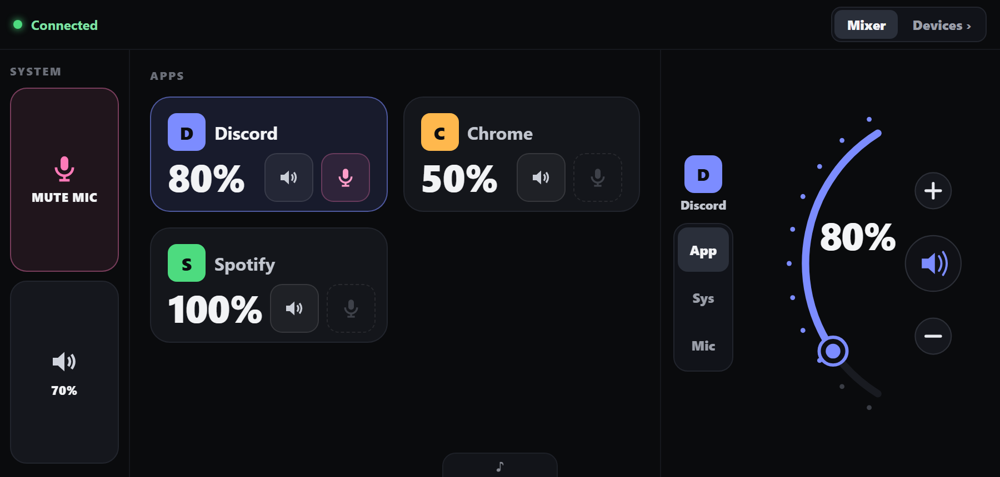
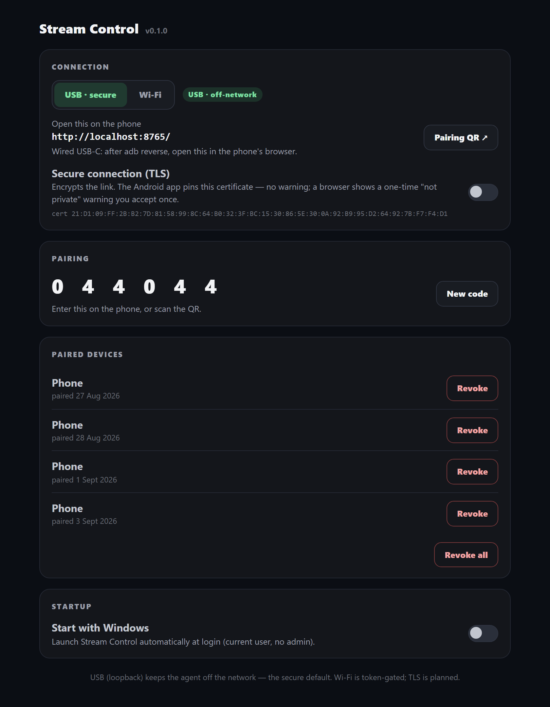
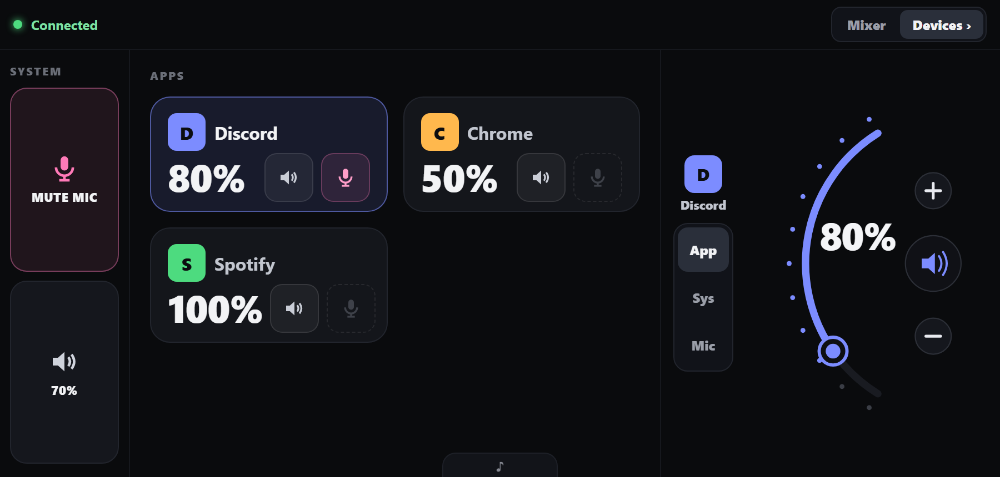
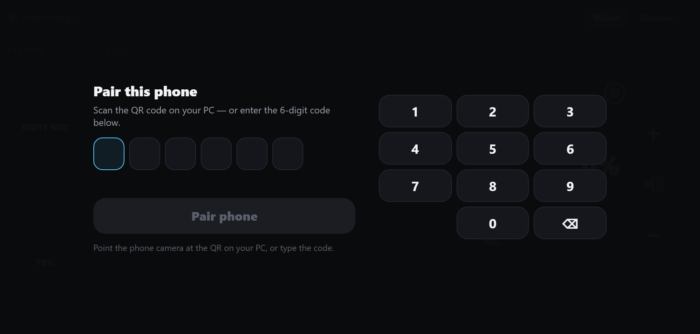

# Deckster

**Turn a spare Android phone (or an iPhone) into a wireless audio mixer for your Windows PC.**

Per‑app volume and mutes, microphone control, output/input device switching, and
now‑playing transport — all from a touch surface on your phone. It's a free,
no‑hardware alternative to a Stream Deck or GoXLR for streamers and gamers.



A tiny agent runs on the PC and serves a touch web app to the phone. On Android you
install a thin native app (below); any other phone just opens it in the browser.

---

## Features

- **Per‑app volume & mute** — a tile per app (Discord, Chrome, Spotify, your game…),
  with the real Windows app icon. Drag the jog dial to set the level.
- **Microphone** — one‑tap mic mute (always a tap away) and mic sensitivity.
- **Per‑app mic mute** — fires the app's own mute / push‑to‑talk hotkey (Windows can't
  mute one app's mic on its own).
- **Output / input device switching** — pick speakers/headset and mic from the phone,
  with live signal meters.
- **Now playing** — title, artist, album art, and play/pause/next/prev for Spotify and
  the browser tab that's playing.
- **Rearrange your app tiles** — long‑press and drag, like an Android home screen.
- **Made for a wall/desk mount** — fullscreen, landscape‑locked, screen stays awake,
  with an OLED burn‑in guard.
- **Secure by design** — only paired devices can control the PC; every command needs a
  token. Wired USB keeps it entirely off the network.

| Settings (on the PC) | Devices | Pairing |
|---|---|---|
|  |  |  |

---

## Get started (PC)

Run from source (Windows, Python 3.10+):

```bash
pip install -r requirements.txt
python -m agent.main
```

A tray icon appears. Click **Settings…** to open the control panel (it opens in your
browser, on `localhost` only). There you'll see the **connect URL**, the **pairing
code**, and toggles for USB/Wi‑Fi, TLS, paired devices, and start‑with‑Windows.

> Prefer a one‑click install? Grab `Deckster.exe` from the
> [Releases](../../releases) page — no Python needed. It's unsigned (open source), so
> Windows SmartScreen may warn once; choose **More info → Run anyway**.

---

## Connect your phone

### 📱 Android — use the app (recommended)

Install `Deckster.apk` from [Releases](../../releases) (allow "install from this
source" — normal for a sideloaded app). Then pick a connection:

**USB — primary, most secure.** Traffic never touches the network.
1. On the phone, enable **Developer Options → USB debugging**, and plug it into the PC.
2. Open **Deckster** on the phone — it finds the PC over USB automatically and
   loads the mixer.
3. First time only: enter the 6‑digit **pairing code** from the PC settings page.

**Wi‑Fi — alternative.** Phone and PC on the same network.
1. In the PC settings page, switch **Connection** to **Wi‑Fi**, and run the one‑time
   firewall command it shows you.
2. In the app, **Scan QR** (or enter the PC's address), then pair with the code.
3. Turn on **Secure connection (TLS)** in settings for an encrypted link — the app
   pins the certificate, so there's **no warning and nothing to install** on the phone.

> **Recommended Android settings:** USB for the lowest latency and best security; Wi‑Fi
> with **TLS on** when you want to go wireless.

### 🍎 iPhone / iPad — use the browser (Wi‑Fi)

iPhones connect over **Wi‑Fi in Safari** (iOS can't do the USB path):
1. In the PC settings page, switch **Connection** to **Wi‑Fi** and run the firewall
   command it shows.
2. On the iPhone, **scan the QR code** from the PC with the **Camera app** — it opens
   Safari and pairs in one step. (Or open the URL and type the 6‑digit code.)
3. Tap the page and use **Share → Add to Home Screen** for a fullscreen, app‑like icon.

> **Recommended iPhone settings:** Wi‑Fi, pair by scanning the QR with the Camera app,
> then Add to Home Screen. Leave TLS **off** for the browser (a self‑signed certificate
> would warn); the pairing token still protects every command on your home network.

### At a glance

| Phone | Connection | Pairing | Secure link |
|---|---|---|---|
| **Android (app)** | **USB** (primary) or Wi‑Fi | code, or scan QR | USB is off‑network; TLS pins the cert on Wi‑Fi |
| **iPhone / other (browser)** | **Wi‑Fi** | scan QR with Camera, or code | token‑gated (TLS optional) |

---

## Security model

- Only **paired** devices can control the PC. Pairing needs a one‑time code shown on the
  PC (proves physical access); it issues a per‑device token (only a salted hash is stored).
- **Every command requires a valid token**; unknown devices get only the pairing screen.
- Runs as the **normal user** (no admin). **Wired USB (loopback)** keeps the agent off
  the network entirely — the secure default.
- **TLS** (optional): the agent serves HTTPS with a self‑signed certificate; the Android
  app pins its fingerprint for a warning‑free encrypted link.
- The **settings page** (`/admin`) is restricted to `localhost`, so a phone on the LAN
  can never reach it — even in Wi‑Fi mode.

---

## Build from source

**PC agent → `.exe`:**

```bash
pip install pyinstaller
pyinstaller build/streamcontrol.spec --distpath dist --workpath build/_work --noconfirm
```

Produces `dist/Deckster.exe` (windowed tray app; logs to
`%LOCALAPPDATA%\StreamControl\agent.log`).

**Android app → `.apk`:** open the [`android/`](android) folder in **Android Studio**
(it has its own README), or from that folder:

```bash
./gradlew :app:assembleDebug   # -> app/build/outputs/apk/debug/app-debug.apk
```

Requires the Android SDK (platform‑34) and JDK 17+. Sideload with
`adb install -r app-debug.apk`.

---

## License

Deckster is free software licensed under the **GNU General Public License v3.0**
(see [`LICENSE`](LICENSE)). You may use, study, share, and modify it; if you distribute
a modified version, that version must also be released under the GPLv3.
