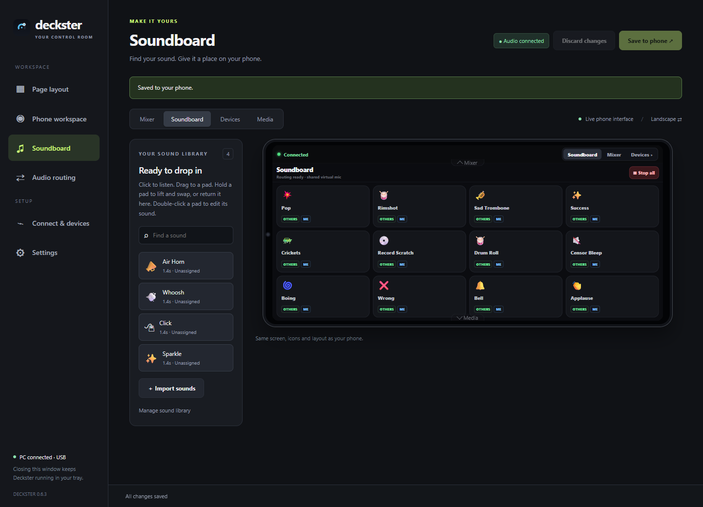
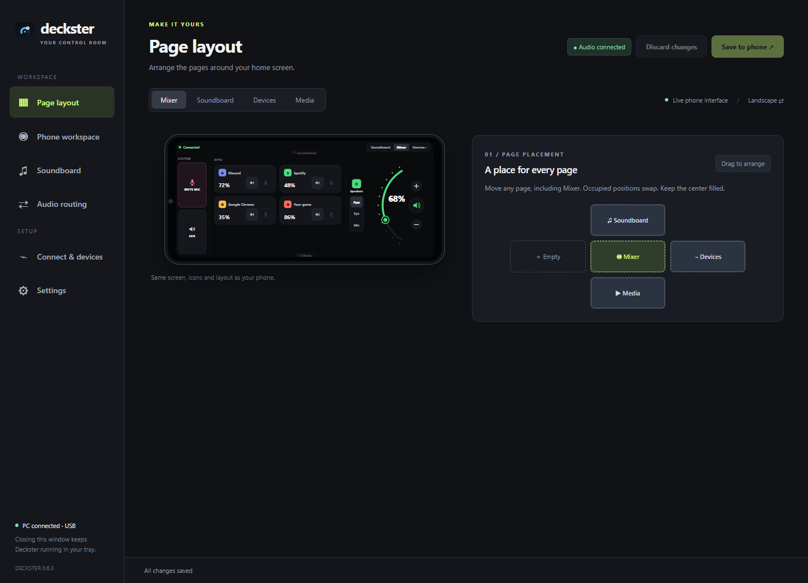
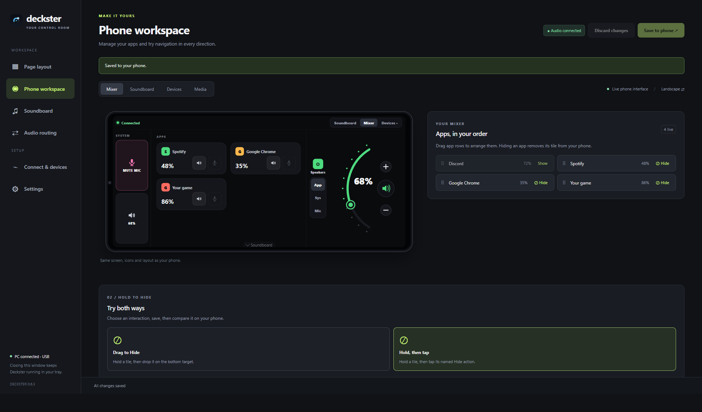
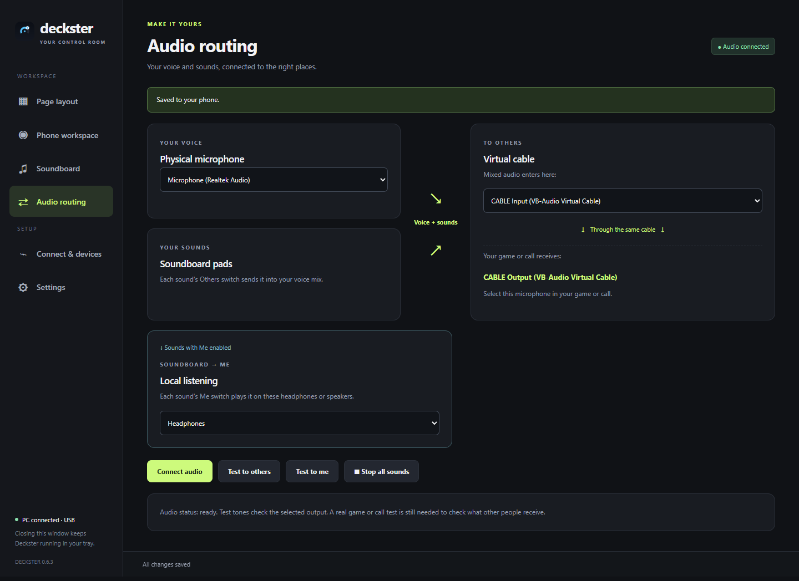

# Deckster

**Turn your phone into an audio mixer and soundboard for your Windows PC.**

Control app volumes, mute your microphone, play sound effects into a game or call,
switch devices, and manage media from a touch screen. Set everything up in a
redesigned desktop workspace with a live preview of the actual phone interface.



## New in v0.6.3

- **A redesigned desktop app** with dedicated Page layout, Phone workspace,
  Soundboard, Audio routing, Connect & devices, and Settings pages.
- **A phone soundboard with 12 assignable pads and 16 CC0 starter sounds.** Import
  WAV, MP3, OGG or FLAC files, click to audition on the PC, then drag sounds onto
  the live preview. Hold a desktop pad to lift and swap it, or return it to the tray.
- **Your phone, your layout.** Place Mixer, Soundboard, Devices and Media around
  the home screen; arrange, hide and restore app tiles; try page navigation in
  the preview. Save to phone applies your edits; Discard restores the saved layout.
- **A visible audio path:** physical microphone + sounds → virtual cable → the
  microphone selected in your game/call, with a separate local listening output.
- **Integrated sound management** for names, icons, volume and Others/Me routes,
  plus a clearly scoped phone-defaults reset that preserves sounds and audio routes.
- **Cleaner phone controls** with smaller Mixer readouts, subtle page chevrons,
  deliberate swipe/hold behavior and clip-duration playback indicators.

These features are in the current **v0.6.3 source**. The latest packaged GitHub
release remains **v0.5.3**; those older downloads do not contain the new desktop
workspace. [Build the current source](#build-from-source) to use this version.

A tiny agent runs on the PC and serves a touch web app to the phone. On Android you
install a thin native app (below); any other phone just opens it in the browser.

> 📖 **Want the bigger picture?** The [illustrated manual](docs/manual.html) walks through how
> Deckster works — the architecture, the connection paths, the security model, and how to fork
> it — with diagrams. Open it in a browser (download or clone the repo to view it rendered).

---

## Features

- **Per‑app volume & mute** — a tile per app (Discord, Chrome, Spotify, your game…),
  with the real Windows app icon. Drag the jog dial to set the level.
- **Microphone** — one‑tap mic mute (always a tap away) and mic sensitivity.
- **Per‑app mic mute** — fires the app's own mute / push‑to‑talk hotkey (Windows can't
  mute one app's mic on its own).
- **Output / input device switching** — pick speakers/headset and mic from the phone,
  with live signal meters.
- **Now playing** — title, artist, album art, and play/pause/next/prev for Spotify and
  the browser tab that's playing.
- **Game-agnostic soundboard** — import clips on the PC, then trigger them from the
  phone with per-pad volume and separate **Others** (call/game) and **Me** (local listening)
  routes. It starts with 16 removable CC0 sounds and 12 assignable phone pads, including crickets, rimshot,
  applause, air horn, and censor bleep. Multiple clips can play at once and
  **Stop all** silences them immediately.
- **Rearrange and hide app tiles** — manage visibility/order from the PC or hold a
  tile on the phone. Choose drag-to-Hide or hold-then-tap Hide.
- **Made for a wall/desk mount** — fullscreen, landscape‑locked, screen stays awake,
  with an OLED burn‑in guard.
- **Paired phone control** — remote phone commands require a valid pairing
  token. Wired USB keeps it entirely off the network.

| Page layout | Phone workspace | Audio routing |
|---|---|---|
|  |  |  |

Screenshots show demonstration sessions in the shared phone renderer.

---

## Get started (PC)

Run from source (Windows, Python 3.10+):

```bash
pip install -r requirements.txt
python -m agent.main
```

A tray icon appears and **Deckster** opens in a dedicated Edge app window.
Microsoft Edge supplies the desktop renderer; a native panel is available as a
fallback if Edge is unavailable. Closing the window keeps Deckster running in
the tray. Use the shortcut or tray → **Show Deckster** to reopen it.

Open **Connect & devices** for the pairing QR/code, USB/Wi-Fi connection options,
paired phones and Windows Firewall setup. **Settings** contains secure phone
transport, start-with-Windows, and restore actions.

> Versioned EXE/APK downloads are on the [public Releases page](https://github.com/isaacmwaura/deckster/releases).
> Check the release version: current source is v0.6.3, while the latest packaged
> release is v0.5.3. Windows builds are unsigned and may trigger SmartScreen.

---

## Connect your phone

### 📱 Android — use the app (recommended)

Install the versioned `Deckster-vX.Y.Z.apk` from [Releases](https://github.com/isaacmwaura/deckster/releases) (allow "install from this
source" — normal for a sideloaded app). Then pick a connection:

**USB — primary, most secure.** Traffic never touches the network.
1. On the phone, enable **Developer Options → USB debugging**, and plug it into the PC.
2. Open **Deckster** on the phone — it finds the PC over USB automatically and
   loads the mixer.
3. First time only: enter the 6‑digit **pairing code** from the PC settings page.

**Wi‑Fi — alternative.** Phone and PC on the same network.
1. In **Connect & devices**, select **Wi-Fi**. If needed, use **Allow Wi-Fi**
   and approve the Windows prompt for the firewall rule.
2. In the app, **Scan QR** (or enter the PC's address), then pair with the code.
3. Turn on **Secure connection (TLS)** in settings for an encrypted link — the app
   pins the certificate, so there's **no warning and nothing to install** on the phone.

> **Recommended Android settings:** USB for the lowest latency and best security; Wi‑Fi
> with **TLS on** when you want to go wireless.

### 🍎 iPhone / iPad — use the browser (Wi‑Fi)

iPhones connect over **Wi‑Fi in Safari** (iOS can't do the USB path):
1. In **Connect & devices**, select **Wi-Fi** and use **Allow Wi-Fi** if needed.
2. On the iPhone, **scan the QR code** from the PC with the **Camera app** — it opens
   Safari and pairs in one step. (Or open the URL and type the 6‑digit code.)
3. Tap the page and use **Share → Add to Home Screen** for a fullscreen, app‑like icon.

> **Recommended iPhone settings:** Wi‑Fi, pair by scanning the QR with the Camera app,
> then Add to Home Screen. Leave TLS **off** for the browser (a self‑signed certificate
> would warn); the pairing token still protects every command on your home network.

### Set up the soundboard

Deckster mixes your physical microphone and clips into a normal Windows microphone
endpoint, so it works with Discord, games, OBS, and other voice apps without game-specific
integration. Windows needs a virtual audio endpoint for this; the current release supports
[VB-CABLE](https://vb-audio.com/Cable/) but does not bundle its separately licensed driver.

1. Install VB-CABLE, then restart Windows if its installer asks you to.
2. Open **Soundboard** on the PC. Click **Import sounds** for your own clips, or
   use the 16 starter sounds. Click a tray sound to listen locally; drag it onto
   one of the 12 phone pads. Replacing a pad returns its old sound to the tray.
   Hold an assigned desktop pad to lift it, then drop it on another pad to swap.
3. Click **Save to phone** to apply assignments. **Discard changes** beside Save
   abandons every unsaved page, app, Hide and pad-layout edit.
4. Open **Audio routing**. Choose your physical microphone, **CABLE Input** as the
   virtual-cable output, and optional headphones/speakers for local listening.
   Click **Connect audio**. The flow shows the receiving microphone name.
5. Select that receiving microphone in Discord, your game or OBS, usually
   **CABLE Output**. **Test to others** sends a test tone into the cable;
   **Test to me** checks the local output. Check the receiving app's own mic test
   to confirm that it receives your voice and sounds.

Each pad can send a clip to **Others**, **Me**, or both. Local monitoring plays
clips only. **Manage sound library** lets you edit names, icons, volume and routes,
including sounds not assigned to a pad. Double-click an assigned desktop pad to
edit its sound. Clip edits save separately from the phone-layout draft.

Use **Page layout** to position all four pages, including Mixer. Occupied
positions swap; Save requires a page in the center. **Phone workspace** manages
app order, visibility, hidden apps and the two Hide interactions. Use the shared
preview to try the pages and navigation before saving.

On the phone, hold an app tile to move or hide it. A sound-pad tap plays the clip;
tapping it again restarts it. Hold a pad for 1.5 seconds to edit its settings.
**Remove** clears the pad assignment; deleting from the PC library removes the
sound file too. Tap an empty **+** to choose an unassigned sound.

**Restore defaults** resets page placement, app order/visibility, Hide preference
and pad assignments. It preserves the full sound library, clip edits, audio
routes, paired phones, connection mode and startup settings. **Restore starter
sounds** is separate: it restores starter sounds and their original settings
while retaining imported files.

Use `--start-hidden` to start the PC agent in its tray without opening a window.
See [CHANGELOG.md](CHANGELOG.md) for the changes and validation limits.
The starter pack is CC0/public-domain and its complete provenance, source hashes, and
per-file hashes live in [`assets/default-sounds/`](assets/default-sounds/).

### At a glance

| Phone | Connection | Pairing | Secure link |
|---|---|---|---|
| **Android (app)** | **USB** (primary) or Wi‑Fi | code, or scan QR | USB is off‑network; TLS pins the cert on Wi‑Fi |
| **iPhone / other (browser)** | **Wi‑Fi** | scan QR with Camera, or code | token‑gated (TLS optional) |

---

## Security model

- Only **paired** devices can control the PC. Pairing needs a one‑time code shown on the
  PC (proves physical access); it issues a per‑device token (only a salted hash is stored).
- **Every command requires a valid token**; unknown devices get only the pairing screen.
- Runs as the **normal user** (no admin). **Wired USB (loopback)** keeps the agent off
  the network entirely — the secure default.
- **TLS** (optional): the agent serves HTTPS with a self‑signed certificate; the Android
  app pins its fingerprint for a warning‑free encrypted link.
- The **desktop workspace** runs on a separate HTTP listener bound only to
  `127.0.0.1`, with Host and Origin checks on its requests. It exposes no phone
  WebSocket and uses no browser certificate exceptions. The phone transport
  retains its own pairing and optional pinned TLS connection.
- The **settings API** is restricted to loopback access, including in Wi-Fi mode.

---

## Build from source

**PC agent → `.exe`:**

```bash
pip install pyinstaller
pyinstaller build/streamcontrol.spec --distpath dist --workpath build/_work --noconfirm
```

Produces `dist/Deckster-vX.Y.Z.exe` (windowed tray app; logs to
`%LOCALAPPDATA%\StreamControl\agent.log`).

**Android app → `.apk`:** open the [`android/`](android) folder in **Android Studio**
(it has its own README), or from that folder:

```bash
./gradlew :app:assembleDebug   # -> app/build/outputs/apk/debug/app-debug.apk
```

Requires the Android SDK (platform‑34) and JDK 17+. Sideload with
`adb install -r app-debug.apk`.

---

## License

Deckster is free software licensed under the **GNU General Public License v3.0**
(see [`LICENSE`](LICENSE)). You may use, study, share, and modify it; if you distribute
a modified version, that version must also be released under the GPLv3.
