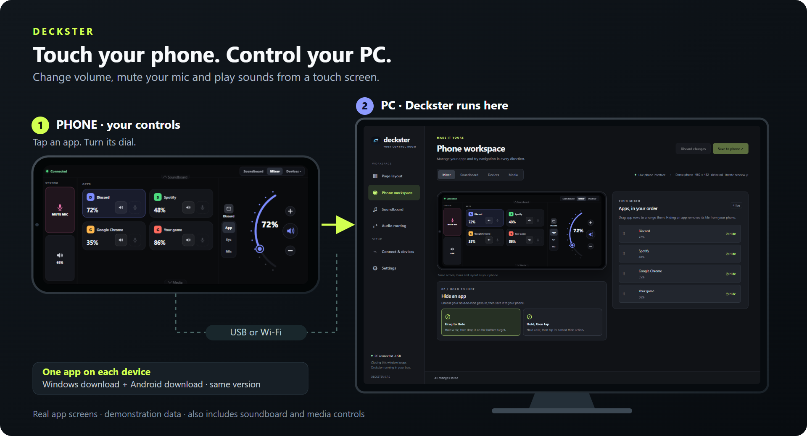
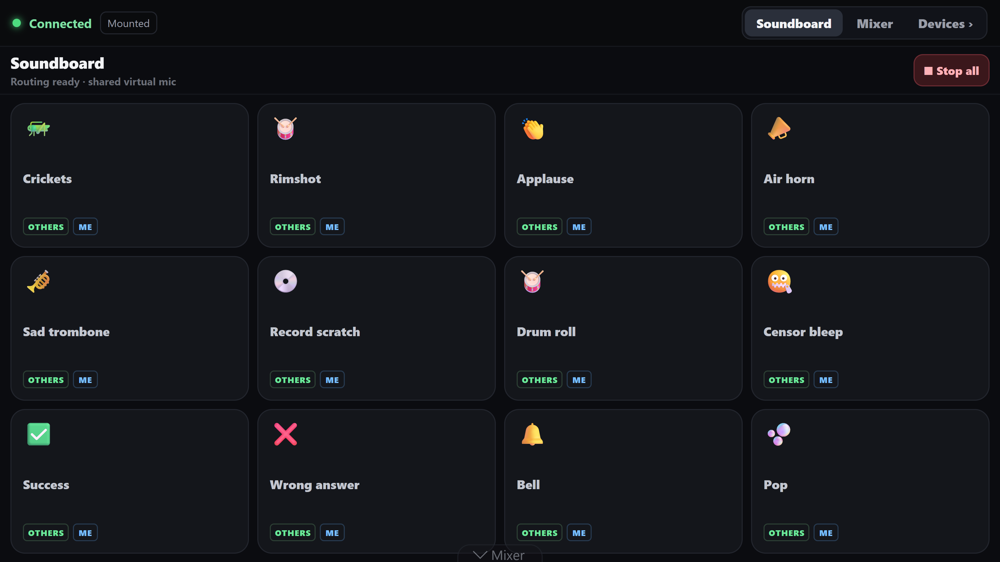

# Deckster

**Use your phone to control sound on your Windows PC.**

Change app volumes, mute your microphone and play sound effects from a touch screen.



*Real app screens with demonstration data. The phone is your remote; Deckster on the PC controls the sound.*

## Install on your PC and phone

Install **both apps from v0.7.0**. The two downloads belong together.

| Device | Download | What to do |
|---|---|---|
| **Windows PC** | [Download the PC app](https://github.com/isaacmwaura/deckster/releases/download/v0.7.0/Deckster-v0.7.0.exe) | Double-click the downloaded file to open Deckster. A Desktop shortcut is created. |
| **Android phone or tablet** | [Download the phone app](https://github.com/isaacmwaura/deckster/releases/download/v0.7.0/Deckster-v0.7.0.apk) | Open the download on your phone and tap **Install**. If asked, allow your browser or file manager to install this app. |

The PC app includes everything it needs to run. You do not need to install Python or enter commands.

The files are also on the [v0.7.0 release page](https://github.com/isaacmwaura/deckster/releases/tag/v0.7.0).
Windows may show a security prompt because the PC app is unsigned. The Android app is installed directly from the downloaded file, rather than Google Play.

## Connect them

Keep Deckster open on the PC and phone. Pick one connection.

### USB — recommended

1. **PC:** open **Connect & devices** and choose **USB**.
2. **Phone:** turn on **USB debugging** in Android's **Developer options**. This lets Deckster connect through the cable. [Android's setup instructions](https://developer.android.com/studio/debug/dev-options#enable).
3. Plug the phone into your PC with a USB cable that supports data. Accept **Allow USB debugging** on the phone if it appears.
4. Open Deckster on the phone. If asked, enter the six-digit pairing code shown on the PC.

### Wi-Fi — no cable needed

1. Connect the PC and phone to the same home network.
2. **PC:** open **Connect & devices**, choose **Wi-Fi**, and use **Allow Wi-Fi** if prompted. Approve the Windows permission request.
3. **Phone:** open Deckster, tap **Scan QR code**, and scan the code on the PC. Allow camera access if asked. Enter the PC's pairing code if requested.

For an encrypted Wi-Fi connection, enable **Secure connection** in the PC's Settings before scanning the code.

**Connected?** The phone opens the controls. Tap an app, such as Spotify, and turn the dial to change its volume. Tap the microphone button to mute or unmute your mic.

## Play sounds into a game or call

Volume and microphone controls work without extra audio software. Sending sound effects into a game or call needs **VB-CABLE**, a separate driver that acts as a virtual microphone.

1. **PC:** [download VB-CABLE](https://vb-audio.com/Cable/), install it as administrator and restart Windows if requested.
2. In Deckster, open **Audio routing → Use recommended settings**.
3. In your game or call app, choose **CABLE Output** as its microphone. Keep your headphones selected for listening.
4. Open **Soundboard** in Deckster, drag a sound onto a phone pad and click **Save to phone**. Tap that pad on the phone to play it.

**Others** sends a sound into the game or call. **Me** plays it in your headphones. You can select either or both.



*The app's soundboard, shown with demonstration data.*

The public build includes **16 CC0 starter sounds**. CC0 means they can be used freely under the included public-domain dedication. You can also import your own WAV, MP3, OGG or FLAC recordings.

## What you can control

- **App sound:** change the volume or mute individual PC apps.
- **Microphone:** mute or unmute, and adjust its level.
- **Soundboard:** assign up to 12 phone pads, import sounds and stop all effects at once.
- **Music:** play, pause or skip supported media on the PC.
- **Your phone layout:** arrange pages and hide or reorder app tiles in the PC workspace.
- **Screen mode:** Mounted keeps the foreground phone screen awake. Battery allows normal screen timeout.

Closing the PC window keeps Deckster running in the system tray, beside the Windows clock. Use the Desktop shortcut or tray menu to reopen it.

### Using an iPhone or iPad?

Install only the PC app. Choose Wi-Fi in **Connect & devices**, leave **Secure connection** off for the browser, then scan the PC's QR code with the iPhone camera. Open the link in Safari and pair if asked. Use **Share → Add to Home Screen** for a home-screen shortcut.

### If something isn't working

- **Phone won't connect:** check the USB permission or that both devices are on the same Wi-Fi network. Reopen Deckster on both devices.
- **Effects aren't heard in a call:** check that the call app uses **CABLE Output**. Use Deckster's sound-delivery check under **Audio routing → Discord & games**, then confirm with the call app's own microphone test.
- **Discord removes effects:** try its **Studio** input profile. For Custom, disable noise suppression, echo cancellation and automatic gain control. [Discord filtering guidance](https://support.discord.com/hc/en-us/articles/360040843952-Krisp-FAQ) and [Studio/Custom setup guidance](https://support.focusrite.com/hc/en-gb/articles/37822488093202-How-to-set-up-a-Focusrite-interface-in-Discord).

Voice quality through the virtual mixer remains under investigation. A successful cable check does not prove what a listener hears in a game or call.

## More help

- [Illustrated manual](docs/manual.html) — connection and soundboard details.
- [Changelog](CHANGELOG.md) — version changes and known validation limits.
- [Architecture guide](docs/architecture.md) — how the app is built.
- [Android build guide](android/README.md) — companion app development.
- [Starter sound licences](assets/default-sounds/LICENSES.md) — sources and permissions.

## Build from source

These instructions are for developers. People using the downloads can skip this section.

**Run the PC source** on Windows with Python 3.10+:

```bash
pip install -r requirements.txt
python -m agent.main
```

**Build the Windows app:** stage `adb.exe`, `AdbWinApi.dll`, `AdbWinUsbApi.dll` and `NOTICE.txt` from Android SDK platform-tools in `bin/adb/`, then run:

```bash
pip install pyinstaller
pyinstaller build/streamcontrol.spec --distpath dist --workpath build/_work --noconfirm
```

Produces `dist/Deckster-vX.Y.Z.exe`.

**Build the Android app:** open `android/` in Android Studio with JDK 17 and SDK 34, or run this from that folder:

```bash
./gradlew :app:assembleDebug
```

Produces `android/app/build/outputs/apk/debug/app-debug.apk`. The downloaded APK is debug-signed for direct installation. See the [Android build guide](android/README.md) for details.

## Licence

Deckster is free software under the **GNU General Public License v3.0**. See [LICENSE](LICENSE). VB-CABLE is separately licensed and is not bundled.
