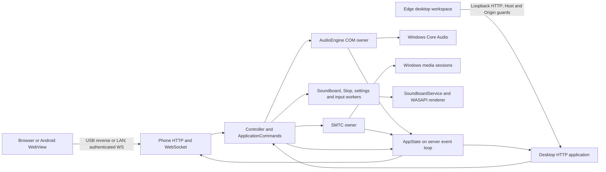
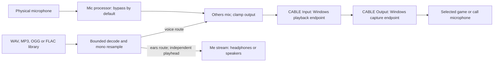

# Deckster architecture

Source baseline: **v0.7.0**, reviewed against this repository on **4 October 2026**.
This guide describes implemented behavior. [The manual](manual.html) covers setup;
[the Android guide](../android/README.md) covers the companion and its build.

## System boundary

Deckster is a local Windows application with a phone control surface. The PC owns
Windows audio controls, sound files, routing, presentation and pairing. The phone
sends control intent and renders PC observations; it does not carry microphone or
soundboard audio. There is no cloud service, account backend or game injection.

The Windows process serves two HTTP applications. The phone listener serves the
PWA and authenticated WebSocket over USB or LAN, optionally with TLS. A separate
plain HTTP listener on an ephemeral numeric loopback port serves the desktop
workspace in an Edge app window. That desktop listener stays available for
recovery when the requested phone listener cannot start.



The desktop phone preview loads the same `index.html`, `app.js` and `style.css`
in a same-origin iframe. It receives draft/live state through `postMessage`, and
routes permitted control actions back through the desktop HTTP facade. It does
not open a paired phone socket. Draft page placement, pad assignment and app
visibility are saved explicitly with a presentation revision.

## Process ownership and concurrency

| Owner | Responsibilities and boundary | Source |
|---|---|---|
| Main asyncio loop | HTTP/WS admission, authentication, command consumers, canonical state and publication | [main.py](../agent/main.py), [server.py](../agent/server.py), [state.py](../agent/state.py) |
| Application command facade | One consumer per domain, shared budgets, coalescing, Stop barriers and result history | [commands.py](../agent/commands.py), [controller.py](../agent/controller.py) |
| Dedicated COM thread | Construct/use/release the Core Audio backend, serialize polls and writes, stamp actual observations | [engine.py](../agent/audio/engine.py), [pycaw_backend.py](../agent/audio/pycaw_backend.py) |
| Dedicated media thread and loop | Own SMTC/winsdk objects, media polling/control and thumbnail reads; marshal plain data to main loop | [media.py](../agent/media.py) |
| Single-worker executors | Separate soundboard, Stop, settings and input execution; slow decode/device work stays off server loop | [controller.py](../agent/controller.py) |
| PortAudio callback threads | Capture physical mic and render Others; separately render Me with independent playheads | [soundboard.py](../agent/soundboard.py), [audio_runtime.py](../agent/audio_runtime.py) |
| Window and tray threads | Edge launch, native Tk fallback, tray menu and show-existing-window requests | [window.py](../agent/window.py), [desktop.py](../agent/desktop.py), [single_instance.py](../agent/single_instance.py) |
| ADB watcher and mDNS worker | Maintain USB reverse mappings and publish active LAN listener discovery | [adb.py](../agent/transport/adb.py), [discovery.py](../agent/discovery.py) |

COM interfaces stay on their apartment. Cross-thread observations are plain
copied data; owner exceptions are detached from native stack/object references.
`AppState` is mutated only on the server loop through marshalled callbacks.
Soundboard lifecycle/library operations use service locks; callbacks do not wait
for the clip lock or write disk logs. Python callbacks still share the process GIL.

## Startup, listener transitions and shutdown

1. Acquire the per-data-directory single-instance guard. A second normal launch
   asks the running instance to show its window; a hidden launch stays quiet.
2. Load settings, choose an available phone port, open the sound library and
   presentation, and create pairing/allowlist, certificate and discovery services.
3. Start the USB watcher unless `--mock` is set; initialize optional window/tray
   threads and build Controller, the COM engine, macro/input registries and media.
4. Start the phone listener through `Runtime`'s connection supervisor. Start the
   independent desktop listener, then media polling. A COM initialization failure
   leaves the control surface available with degraded readiness.
5. During shutdown stop listener transitions/media/HTTP serving and auxiliary
   watchers, drain application commands and audio recovery, then close the
   soundboard, stop the COM owner, close the loop and release the instance guard.

`Runtime` distinguishes saved **requested** mode/TLS from **active** mode/TLS.
Preference writes precede requested-state mutation. One rebind task serializes
changes and coalesces obsolete generations; successful active configuration
drives mDNS. A failed bind attempts to restore the previous listener without
overwriting the saved request or silently persisting insecure transport.

Command/recovery drain reports a deadline and retains running owners until they
finish. A timeout cannot undo a native write. Final synchronous native audio
stream close has no watchdog and can hang. There is no separate audio worker
process or guaranteed termination of an individual native operation.

## Commands and causal state

Phone WS and desktop workspace audio/presentation actions enter the same
`Controller` / `ApplicationCommands` facade. Inputs are validated and copied before
asynchronous execution. Security, firewall and native-window administration use
their separate local administration boundary. Legacy Tk Advanced sound library
import/restore/remove calls go directly to the serialized service and do not
participate in the facade's global admission budget. The server also retains
per-socket fallback lanes for injected/legacy controllers without the facade.

| Domain | Commands |
|---|---|
| `audio` | `set_volume`, `set_mute`, `set_default_output`, `set_default_input` |
| `media` | `media_control` |
| `input` | `macro`, `app_input_mute` |
| `soundboard` | Play, audition, import, clip edits, routing, format checks and receiver verification |
| `stop` | `soundboard_stop_all` |
| `settings` | Presentation updates/defaults, macro registry and input-binding edits |

A slow media operation cannot queue a same-phone volume change behind it. `ping`
and `subscribe` are handled by transport without waiting for application work.
Each domain is sequential; commands in different domains can make progress
independently, subject to the native owners and service locks they use.

Pending volume writes coalesce by stable target across participating clients;
replaced identified commands receive `superseded`. Stop has its own execution
lane, invalidates older queued/prepared playback and gates later plays until
Stop completes. Service/renderer generations additionally prevent late decode
completion from restarting a stopped or replaced route.

### Wire contract

The client first sends `hello` with its token, or `pair` with the one-time code
and device identity. Successful authentication yields a current snapshot.
Subsequent `subscribe` requests obtain another snapshot. `viewport` records
authenticated screen dimensions for the desktop preview and is cleared on socket
disconnect. Tokens authorize the connection; they are not attached to every
individual volume command.

A snapshot contains `serverEpoch`, capabilities `command-results` and
`owner-sequence`, sessions, devices, macros, `appInputBindings`, media, soundboard
and presentation. Identified commands supply `commandId` and `clientSeq` with the
existing type/target. If a command supplies `serverEpoch`, admission rejects a
mismatch; the shipped frontend negotiates the epoch from snapshots and tracks it
when reconciling results.

```json
{"t":"set_volume","commandId":"phone-run:7","clientSeq":7,"target":{"kind":"session","id":"opaque-session-id"},"level":0.62}
```

Results use `t: "command_result"`, the same command identity, `serverEpoch` and
one of these statuses:

| Status | Meaning |
|---|---|
| `accepted` | Admitted; execution is still pending |
| `applied` | Execution completed; volume/mute includes actual owner readback |
| `superseded` | Replaced/coalesced, stopped, disconnected while queued or discarded during shutdown |
| `failed` | Rejected or failed with error data |
| `outcome_unknown` | A started operation may have taken effect; refresh observed state before another action |

Volume/mute write and readback occur in one COM owner turn. The result includes
`ownerSeq`, target and observation. Polls use the same sequence authority. The
state reducer rejects older observations per target and maintains a session
membership watermark so a delayed poll cannot resurrect a removed session.

The negotiated phone retains current local intent until its linked result,
reconciles against the newest owner observation, and ignores results from another
epoch. Legacy clients keep the older compatible messages and temporary volume
guard. Reconnect clears pending local actions, fetches fresh state and never
replays effects, media toggles or hotkeys automatically. Disconnect discards
queued work from that socket but leaves running operations with their owner.

Deduplication is scoped to device/local-client identity and process epoch, with
bounded retained history. Reusing an ID with changed request data is rejected.
This does not provide exactly-once execution across restart or history eviction.
An `applied` play result confirms renderer admission, not receipt by a listener.

## State publication and frontend work

Snapshots and worker inputs are copied so asynchronous work cannot follow mutable
drafts. Each state subscriber has **one pending message**. If a partial update
would overwrite another pending change, a fresh complete snapshot replaces the
pending item, preserving current state without a backlog of old dial levels.

Unchanged durable audio state suppresses full snapshots. Changed media,
soundboard, presentation and meters use separate messages. Ordinary audio polling
defaults to 400 ms (minimum 100 ms); endpoint discovery is cached separately with
a default 2-second interval. Media polls default to 1.5 seconds. Soundboard route
recovery refresh is coalesced and normally checked at most once per second unless
the endpoint lists change. Clip durations are refreshed outside ordinary reads.

The phone keeps controls stable during gestures, owns pointer capture until
release/cancel and uses relative volume movement. Hidden/saver rendering keeps
latest state for one resume render. Device meter animation stops when its page
is covered. Background lifecycle suspends connection work and clears pending
gestures/sends; foreground resumes from fresh state.

The desktop refreshes full workspace data every 1.2 seconds when visible.
The routing page reads lightweight measured signals every 70 ms when visible;
it skips overlapping reads and stale results. Hidden desktop windows suspend
requests and notify the shared preview to suspend work. Backend level collection
remains periodic; consumer-negotiated sampling is deferred.

## Audio data path

Windows volume/mute control and soundboard sample rendering are separate paths.
Core Audio controls change Windows endpoints/sessions. The soundboard captures
its saved physical input and renders to a selected WASAPI playback endpoint.
Per-app mic mute uses configured simulated hotkeys (`agent/macros/`), not an
independent Windows capture gate for each app. Key injection acts through the
focused application; app bindings describe the combo, not a new per-app audio bus.



Others/Me UI labels correspond to stored `voice`/`ears` clip flags and
`voiceOutputId`/`earsOutputId` routing fields. The main duplex stream runs at
48 kHz; Me renders clips independently and never monitors the physical mic.
An optional-monitor failure does not stop microphone + Others. Re-triggering a
clip restarts that clip per bus; different clips can overlap within budgets.

Endpoint IDs are persisted. Runtime lookup selects numeric WASAPI devices rather
than ambiguous repeated names across host APIs. The renderer accepts generic
endpoints; the guided routing UI specifically validates matching VB-CABLE ends
and physical mic/monitor choices. VB-CABLE is separately installed and not
bundled. Per-app microphone routing, VoiceMeeter remote control and an owned
virtual audio driver are deferred.

Mic processing is an injectable `prepare/process/reset/close/health` interface
before clips join the mix. The shipped processor copies captured mic samples;
no denoiser, EQ, model or DSP engine is selected. Preparation stays outside the
callback, and processor failure exposes bypass while preserving speech. Clips
never pass through microphone processing.

The runtime uses preallocated scratch, in-place mixing and bounded slices for
variable callback blocks. Completed sample references are reclaimed outside
callbacks. These measures reduce callback work but do not provide hard real-time
guarantees in Python or establish game-load/Discord fidelity.

### Admission and resource limits

Defaults are defined in [commands.py](../agent/commands.py),
[engine.py](../agent/audio/engine.py), [audio_runtime.py](../agent/audio_runtime.py)
and [soundboard.py](../agent/soundboard.py).

| Budget | Default |
|---|---|
| Participating application commands | 96 globally, counting queued and running work |
| Pending commands per domain | 32 |
| COM queue | 64 entries |
| Retained terminal command results | 256, process/epoch local |
| Encoded application command / phone WS message | 64 KiB |
| Desktop imported file | 64 MiB maximum upload; separate local multipart path |
| Decoder source | 128 MiB encoded, 8 channels, 384 kHz |
| One decoded clip | 300 seconds and 64 MiB |
| Active unique decoded samples | 128 MiB across buses |
| Polyphony | 12 voices per bus |
| Preparation leases | 2; retained until consumed/discarded |
| Reusable decoded cache | 64 MiB, 32 entries |
| Decoder / callback slices | 4,096 source frames / 8,192 runtime frames |
| Callback metrics / playback traces | 512 metric samples per bus / 64 traces |

Decode reads compressed audio in chunks and rejects over-budget input visibly;
it never silently truncates a long effect. Shared arrays used by both buses count
once toward active sample bytes. A conservative decoded-array ceiling is 320 MiB
for the main renderer plus up to 64 MiB for audition. Native buffers, decoder and
driver allocations, Python and Edge memory are additional; ceilings are not
typical RAM use or a performance promise. Limits are configurable in code via
`AudioRuntimeLimits`, not a user-facing streaming music feature.

Saved routes recover stopped streams or returning devices with delayed retries
capped at 30 seconds. Retry does not rewrite preferences or substitute a missing
physical input. Failed native cleanup retains the old handle before replacement;
monitor recovery is independent. Receiver verification sends an explicit matched
probe and temporarily captures the paired cable endpoint without saving a
recording. Read-only diagnostics do not initiate that probe.

The phone mic master controls the **Windows default capture endpoint**, which can
be the virtual cable. It does not necessarily change physical microphone gain.
Changing Windows default input also does not override an app's explicit mic choice.
Meters, traces, cable probes and speaking indicators cannot establish complete
effect/voice receipt in a call; that requires listening at the receiving app.

## Transport, authentication and local boundaries

| Surface | Binding and access |
|---|---|
| Phone HTTP/WS | `127.0.0.1` in loopback mode; `0.0.0.0` in LAN mode; HTTP or HTTPS according to saved preference |
| USB | Fixed phone `localhost:8765` reverse-tunnels to the selected PC port (default 8765, with conflict fallback) |
| Desktop HTTP | Ephemeral `127.0.0.1` port, plain HTTP; loopback peer and numeric Host required; non-read requests require exact same Origin; no `/ws` |
| Administration on phone listener | Loopback peer and local Host API guards; workspace writes/import additionally require exact Origin |
| `/health` | Process liveness: `{"ok":true,"app":"deckster"}`; not audio readiness |
| `/ready` | Local peer/Host only; 200 or 503 according to COM engine and active connection readiness |
| `/admin/api/diagnostics` | Local guarded, read-only engine, command, connection and audio health/trace data |

Pairing uses a single-use six-digit code, default 180-second lifetime and a
five-attempt budget. The server issues a random 256-bit token and stores only its
salted SHA-256 hash in the allowlist. Identity is token-based across USB and LAN.
Revocation changes future token authentication; an already authenticated socket
is not continuously rechecked against the allowlist in this implementation.

TLS uses a persistent self-signed certificate. Android verifies the certificate
fingerprint obtained from QR/discovery or the saved PC; missing/mismatched pins
fail closed. Discovery carries connection hints and a fingerprint, not pairing
authorization or a public CA trust chain. Browser clients have their browser's
self-signed trust constraints. TLS protects transport; tokens protect command
access. Plain HTTP LAN mode remains available by explicit setting.

Phone `/qr` exposes pairing information only to a local peer. Static assets,
app icons and media thumbnails are served separately from command authorization.
Firewall setup is an explicit local helper; discovery/reconnect does not silently
open the firewall. The service worker provides a network-first cached shell;
offline shell display cannot perform PC commands without a live connection.

## Android lifecycle and persistence

The Kotlin/Compose app hosts the PC-served phone renderer. `ConnectViewModel`
owns a cancellable connection attempt and generation ticket, probes USB first,
and searches LAN through NSD. QR scanning uses CameraX/ML Kit. Late probe/discovery
results are rejected after foreground/generation changes. USB loss can offer a
Wi-Fi handoff; acceptance reconnects and reauthenticates with the existing token.

`MainActivity` propagates foreground state, pauses/resumes owned WebViews and
releases bridge/loading/renderer resources on disposal. Renderer loss destroys
the old WebView and exposes native Refresh recovery. `DeckBridge`, exposed as
`AndroidBridge`, provides token/device identity, power mode and connection-loss
hooks; callbacks hop to the Activity's UI owner.

`Store` persists token, device identity, last PC/TLS pin and Mounted/Battery mode
in app-private SharedPreferences. It is not encrypted storage. Browser
localStorage remains per origin; the native store bridges USB/Wi-Fi origins.
Mounted keeps the foreground screen awake. Battery permits normal screen timeout
and avoids browser wake-lock acquisition. Background work is suspended rather
than running a permanent Android foreground service. `adb install -r` preserves
app data; PC presentation and clips stay on the PC.

## Durable data and failure semantics

All runtime/user data uses `%LOCALAPPDATA%\StreamControl` (the pre-rebrand name is
intentional). Bundled assets resolve from the source root or PyInstaller's
`sys._MEIPASS`; neither location is the mutable settings directory.

| Data | Owner / purpose |
|---|---|
| `settings.json` | Transport preferences, poll interval, token salt and pairing defaults |
| `allowlist.json` | Device names and token hashes |
| `cert.pem`, `key.pem` | Persistent server TLS identity |
| `macros.json`, `app_bindings.json` | Hotkey actions and per-app mic bindings |
| `presentation.json` | Revisioned pages, app ordering/visibility, Hide mode and exactly 12 nullable pad slots |
| `soundboard/library.json` and clip files | Imported/default clips, metadata, gain/routes and selected audio endpoint IDs |
| `connect_qr.png`, `agent.log`, `desktop-browser/` | Generated connection aid, rotating logs and dedicated Edge profile |

JSON mutations generally use temporary files plus replace to avoid torn writes.
Presentation edits require `baseRevision`, conflict rather than overwrite another
editor, validate unique pages/slots and roll back on failed save. Corrupt
presentation bytes are copied aside before restoring defaults. Macro/binding and
soundboard failure paths preserve previous published values; default-pack file
replacement has rollback. These are per-service guarantees, not one database
transaction covering every file. Startup repairs dangling pad references after
a library deletion/presentation write interruption.

Starter assets include 16 CC0 sounds, a manifest, source/license provenance and
SHA-256 checks. Installation/upgrades verify assets and preserve intentional
deletions/customizations. Restoring phone defaults resets presentation only;
restoring starter sounds is a separate explicit action. No runtime user data,
token, recording or private build receipt belongs in source control.

## Repository map, builds and verification

| Area | Contents |
|---|---|
| `agent/audio/` | Backend protocol, mock and Windows Core Audio implementation, COM owner |
| `agent/security/`, `agent/transport/` | Pairing/tokens/allowlist and USB reverse watcher |
| `agent/macros/` | Validated hotkeys, registry and input-binding persistence |
| `agent/` application modules | Bootstrap, server/controller/state, media/icons, soundboard/runtime/mic processor, presentation/routing and desktop/platform helpers |
| `web/` | Shared phone PWA, desktop workspace, legacy admin page, styles/assets/service worker |
| `android/` | Gradle wrapper/config, Kotlin shell/Connect/QR/store/network policy and launcher resources |
| `assets/default-sounds/` | Starter audio, provenance, manifest and integrity hashes |
| `build/` | Frozen entrypoint, icon generator and PyInstaller spec |
| `tests/` | Offline Python regressions, isolated native/Tk probes and four Edge/Playwright frontend suites |
| `tools/` | Starter pack generation, offline/process profiles and delivery/package verification |

Source/build commands are in [README](../README.md#build-from-source).
The Windows spec bundles Python/dependencies, web assets, default sounds and
staged Android platform-tools (`adb.exe`, its DLLs and `NOTICE.txt`). It emits a
versioned windowed EXE. Android builds separately with SDK 34 and JDK 17;
`applicationId` remains `com.streamcontrol.shell`, versionName 0.7.0/code 18.
The wrapper is committed. Debug APKs are debug-signed; release signing must be
configured separately. VB-CABLE and Edge are external dependencies.

For offline regressions use `python -m pytest -q -m "not live"`. The browser
suites are `phone_presentation_headless.cjs`, `phone_responsiveness_headless.cjs`,
`phone_lifecycle_protocol_headless.cjs` and `desktop_workspace_headless.cjs`;
they require Playwright and use the installed Edge executable.
`--mock --no-tray` supports isolated control testing and disables live USB watching,
but it is not a global prohibition on all soundboard activity: use an isolated
`LOCALAPPDATA` and avoid invoking audio actions for hardware-free checks.

Key regressions cover cross-domain commands, global pressure/coalescing/Stop,
owner sequencing, reconnect/epoch results, persistence failure, listener rollback,
callback/decoder bounds, long-effect tails, independent monitoring and native
cleanup ownership. Media tests cover current-session selection and real image MIME.
Platform tests cover TLS, discovery, firewall, shortcuts and single-instance behavior.

The recorded rebuild verification is 270 offline Python tests, four browser
suites, EXE/APK builds and isolated packaged readiness/protocol checks. Those are
historical implementation receipts, not a claim that hardware acceptance passed
or that every check ran during this documentation update.

Outstanding acceptance: quiet/normal speech and complete effects at a real
Discord listener (direct mic versus mixer, PTT/VAD, overlap and reconnect), clear
game-chat regression, controlled callback scheduling/game frame-time profiles,
physical phone gesture/handoff/renderer-loss checks and unplugged power use.
Short startup observations recorded continuing deadline misses despite no
PortAudio interruption flags. No denoiser/native process choice or demonstrated
CPU/RAM/battery saving should be inferred from offline/mock checks.
